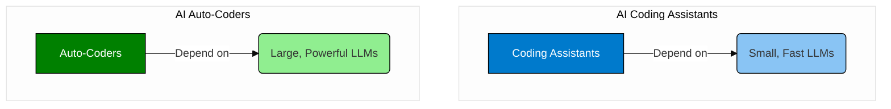
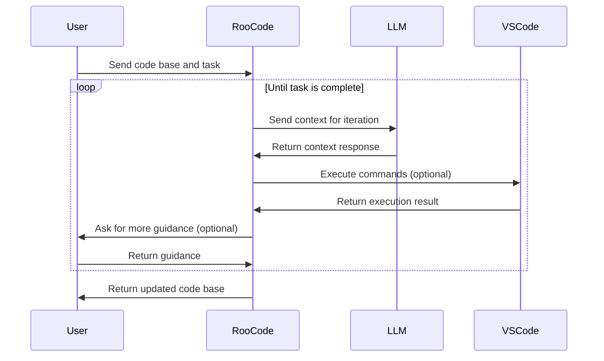

# Roo Code - Autocoder and local LLMs

## Motivation

Roo Code is boosting developer productivity by leveraging cloud-hosted LLMs (Large Language Models). Cloud-hosted LLMs like Claude Sonnet 3.7 open GPT-4o are showing amazing results with their context awareness and ability to solve complex coding tasks.

Here is a recording of 2 real world refactoring tasks with Roo Code against OpenAI GPT-4o (with deliberately loose instructions). Quite cool:

[](media/roo-openai.mp4)

However, with cloud hosted backends comes a steep cost, as you pay per token. And in complex refactoring, you quickly end up with millions of tokens used. This takes the fun out of it quite a bit, e.g. for recreational coding projects. Luckily, with Roo Code you can choose the backend, and also run against locally hosted LLMs using Ollama. This can potentially save you tons of money, if you choose to run it on capable consumer hardware, like your son's gaming PC while he is sweating in school. 

But how well does it work? Why is not everybody doing it this way? As I was looking for answers on the internet, I found a lot of information about problems, but not much useful guidance for how to overcome them. 

GusoCoder published an encouraging video a few weeks ago, which triggered me to give it a spin only own hardware. I wanted to understand what was going wrong, and what we potentially could do to fix it. 

[](https://www.youtube.com/watch?v=7sgSBLIb0ho)

So, I threw myself at it, and described my experiences here, in the hope to inspire someone else to also share their experiences - or at least to save someone else's time trying to get their heads around it. 


### For the impatient

Yes, it works! But you need to keep your ambitions a bit lower. The local setup cannot compete with the cloud hosted model in speed and quality. Though, if you reduce your ambitions, and are willing to put in the time, you can definitely make it work.

Plus... there is an option to choose a hybrid approach, such as hosting Ollama yourself on services like runpod.io, whch provde good hourly rates powerful GPUs. This lets you go absolutely crazy for a few hours without worrying about cost every single time you press a button.

In my case, I am not getting the same results as GusoCoder in the video linked above. But that is probably because of differences in our setup, and differences of the tasks we are giving to for Roo Code to complete.

This suggests that you will have to see for your self if you will find a useful configuration on the hardware you have available.


### Landscape in February 2025

Nearly every week brings new, groundbreaking innovations to the public AI space. The AI models that were turning the world upside down last week are replaced by even more capable models — sometimes even for free — the following week. Models like GPT-4o, Deepseek R1, Grok, Mercury and others continue to emerge. In this rapidly changing environment, it seems super hard to stay on top of the latest developments.

While ever higher intelligence is fascinating, It is hardly useful for the masses, if it cannot be applied in practical fields. Unless we reliably solve the applicability problem, AI will remain a fascinating dream rather than a reality for most of us.

The world seems to realize that there likely won't be a single LLM that can solve everything. Instead, numerous small models, carefully trained for specific purposes and well-orchestrated to fulfill difficult or tedious but specific tasks, are emerging. The industry is developing protocols like MCP to allow the creation of specific AI agents that can be combined into larger autonomous workflows. 

This approach, dubbed "Agentic AI" by technology leaders at Nvidia and Microsoft, makes training smaller, more specialized models manageable and economically feasible on smaller budgets. It also confines advances and regressions in specific areas, allowing controlled advancements at manageable quality within a larger ecosystem.

It seems that we are at a bit of a turninging point towards decentralization and democratization of AI. Something that will definitey help the broader adoption into real world tasks.


### Auto-coders and Coding Assistants

The discipline of a software engineer fits very well the description of such specific area with real world tasks. In this field, we see several promising products emerging, such as Copilot, Windrurf, Continue, or Roo Code (formerly Roo Cline), making use of Large Language Models (LLMs).

One one hand, there are coding assistants like Copilot, which act more like chat interfaces and provide capable auto-completion, are rapidly becoming common in a software engineer's toolbox for accelerated code analysis, development, review, and debugging.

The category of autocoders on the other hand, can autonomously complete coding tasks. The engineer formulates a specific task for the autocoder, who then executes the task and provides the completed changes for refinement and approval. Auto-coding requires much stronger context awareness and higher precision of the LLM, so that a coding task can be carried out to completion.



More often than not, software engineers work with existing codebases where years of thought have gone into producing the desired outcome concerning functionality, performance, security, robustness, or maintainability. To autonomously complete a refactoring task satisfactorily, the autocoder needs to infer from existing code the structure, intent, and quality aspects before coming up with a reasonable plan for making changes.

Doing this well reuires the build-up of lare context for achieving the desired result. Autocoders must manage this context, and help the LLM to iteratively refine the understanding, call tools for knowledge acquisition, and apply changes to the actual codebase. This more involved workflow is what sets autocoders apart from simple coding assistants. 

### Appreciation for Roo Code

Roo Code is well-established in the community as a super accessible autocoder that integrates seamlessly into VSCode workflows, such as applying code changes, executing commands directly in the VSCode terminal, integrating with source control, working with diffs, etc.

It can be configured to use local LLMs using Ollama and is open-source, allowing us to explore why something works or doesn't and fix it if necessary. 

What stands out most is that Roo Code lets you define custom roles in the context of the codebase you're working on — e.g., for coding, as an architect, for asking questions to build understanding. Choosing a role affects Roo Code's behavior, making it feel like you're working with a colleague specializing in a particular area. You can ask for understanding, get architectural considerations, and have the coder implement changes to perfection.

While default roles do a decent job, you can also create your own—e.g., as a helpful reviewer or tech writer — and specialize them further to focus on specific quality aspects like robustness, performance, or security — important for real-world tasks. 

Additionally, Roo Code has an active community with frequent discussions on Discord and regular releases, lowering the time needed between ideation and release of new versions.

## Identifying the problem

### So, how does Roo Code work?

Debugging VSCode and the Roo Code plugin to understand their inner workings can be daunting due to a lot of code running unrelated to LLM interactions. The better way I found was enabling debug logging on Ollama and monitoring HTTP traffic between Roo Code and Ollama.

As LLMs are inherently stateles, and they have no access to storage or tools, every interaction with the LLMs needs to be accompained with complete context of what Roo Code was about to do. Context starts typically small, but grows, as Roo Code iteratively progresses through the task together with the LLM. Solving complex tasks requires many iterations, which leads large context sizes.

In Roo Code, calls to the LLM range from 200kb per call upwards, even if you just ask the model to explain a few lines of code. With each iteration, the message grows in size as more information.

The message to the LLM, or prompt, contains everything: for example, the system prompt explaining how the model should behave and format responses— including what tools it can request to be called. The user prompt includes your request to the LLM, the contents of any referenced files, and all previous interactions with the LLM so that it can decide what to do next without starting from scratch.

The reply from the LLM, or assistant prompt, is streamed back to Roo Code, one token at a time. Once Roo Code has received all tokens, it parses the message and decides what to do next. The LLM may request a tool call, such as read_file, if it thinks more information contained in a file wasn't provided before. It might ask for changes to be made to a file or a folder to be created. Roo will then ask you whether the request is reasonable and execute it if approved—or configured for auto-approval. The result of the tool call will then be embedded into the context for the next call to the LLM.



Some tool calls re prone to fail due to wrong assumptions by the LLM, lack of specificity in the task, or vague system prompts in Roo Code. After all, Roo Code supports many combinations of LLMs and operating systems, and it's system prompt may therefore not match perfectly your setup. To handle these cases, Roo Code has built-in checks that evaluate the LLM response and send corrective instructions when faults happen.

The less your model, operating system, system prompts, and hardware capabilities are aligned, the more you will observe faults during task execution and have Roo Code circle back to the LLM for re-evaluation. Eventually, the LLM and Roo Code accumulate enough knowledge in the context and agree on making code changes, completing the task set up for it, and presenting the output.

Roo Code wraps things up and leaves it up to you to do a code review and submit the altered code to the source code repository. You're now ready for the next task.

### Here's What Is Hard

Simple tasks like "remove all unreferenced private functions in class XYZ" are easy, require few iterations, and are likely to succeed. Even intellectually difficult tasks like "improve my algorithm in function XYZ for performance at the expense of memory" can be carried out with ease — given that your LLM is trained for this. The task itself, the system prompt, as well as the complete context can be wrapped up and sent at once.

But when it comes to more involved tasks, such as "break down class XYZ for maintainability and factor functionality ABC out into a separate class", the LLM won't have all necessary information in one pass. It needs to create new files, gather more information about where the class is instantiated from, and what functions are publicly used. The LLM and Roo Code will work iteratively to make step-by-step plans, gather information, create file structures, etc., building up a large context passed back and forth.

Two interesting things now happen:

- Minor decisions in early iterations become hard facts as the evolving context builds around everything learned. Incorrect assumptions or imprecise formulations amplify in subsequent iterations, standing indistinctly in the context for the duration of the entire task. If the LLM is not capale of precise interactions with the task at hand, the likelihood of wandering off into a wrong decision path and producing unusable code increases. Roo Code won't likely detect this, leaving you to wonder what happened.

- With increasing number of iterations, the physical size of the context grows large and eventually outgrows the model's context limitations. When that happens, the model either truncates its response or becomes very loose when considering the provided context. In the best case, Roo Code gets upset and decides to quit the task. In the worst case, Roo Code keeps trying to get the model back on track but makes the matter with context size worse inevery iteration.

In essence, simpler tasks have a higher chance of success. To benefit most, find the best possible combination of model, configuration, system prompt, and hardware capabilities for your task. If all parameters are defined, break down tasks for Roo Code into smaller, more manageable pieces.

Finding the right balance is difficult, and can cause a lot of frustration. There is no definitive answer for what works in all cases. Solutions are individual, and not much guidance is available on the internet.

This is probably exactly why hosted solutions like Claude 3.7 Sonnet keep attracting customers — despite their high costs. Their configuration is consistent, models are fine-tuned with great precision, Roo Code has system prompts tested with it, and backing hardware supports extremely large context. Essentially, you get the best possible setup—at an unfavorable price point, which just works.


## Breaking it all down

### Do you want speed or size?

Most models can work purely on CPU and off-load to GPU for faster processing. This makes it virtually possible to run the largest models with complex tasks on cheap hardware—with enough system RAM and disk space. However, for reasonable speeds, the model and context should ideally fit entirely onto your GPU, reducing VRAM swapping. Running inference tasks on the GPU instead of a combination of CPU and GPU literally makes a speed difference of factors tens or hundreds.

For practical application with iterative refactoring of code, it is highly advisable to run 100% on GPU. When loading the configured model in Ollama, check with the folloing command to what extent Ollama runs your model on the GPU:

```bash
ollama ps
```

### How Many Billions of Parameters?

Models come in sizes that a re defined during training, often designated in their names or tags as: 230b, 70b, 24b, 14b, 8b, 3b, 1.5b, etc. The more parameters in the model, the more nuanced it can be.

On my setup, model with 8b and 14b provide a good starting point. With 36GB of VRAM, there is then still ample of space left for context.

I can run 24b models, but the available space for context becomes impractically small.


### Focussed Training

When choosing a model, it's best if the training of the billions of parameters is dedicated to coding tasks. The majority of the training should be done on programming languages. General purpose models carry a lot of dead weight along, which is not useful for programming.

Models designated as 'instruct' or 'coder' indicate that they are fine-tuned for following automated instructions or specific coding tasks. They tend to be worth a closer look.

Popular models with focus on coding include Mistral, Qwen2.5, Phi4, CodeLlama, Deepseek-Coder, and more. Some models are distilled from larger, general-purpose models, allowing them to have similar or even better capabilities using less hardware.

Finding a model that suits your task is your own challenge. For my part, I seem to have best results using Qwen2.5-derived models.

### Quantization: Save space at the cost of precision

Next to the context, most VRAM utilization of a loaded model comes from trained parameters (model weights) stored in multidimensional arrays (tensors). Every parameter is represented by a datatype — most commonly 32-bit as fp32 during training. 64-bit representations offer better precision but are extremely uncommon outside scientific realms.

Here's the problem: if you choose a 24b model with training that fits your needs and run it at 32-bit precision, your model alone will consume `24b * 32bit = 96GB` of VRAM. This doesn't even include memory required for context. That amount of VRAM hardly counts as consumer-level hardware.

This is where quantization comes in: It is the conversion of parameters into smaller, lower-precision data types. Common representations are 16-bit (fp16 or bf16) at half precision — therefore requiring half the space.

With low VRAM, you likely need to go even lower than that, for example to 8 bits (Q8), or even further down to Q6, Q5, or Q4. Reduction in data precision directly affects model precision, and at too low precision, the model will start hallucinating easily, turning refactoring tasks into comedy.

In my case, with 36GB of VRAM, I see reasonable results with Q8 quantization of a 14b model on Qwen architecture and training.

### Large context allowence is not always better

Context size is the last but probably most important thing to consider. While easy to imagine, it's likely the least trivial to get right. Here's some explanation:

The contex size os measured in numer of tokens. Tokens are sequences of bytes that were identified during model training — typically a word, stem, or punctuation. Typically one a few bytes long. 

When determining the optimal context size for your setup, you need to consider what the context is used for. Firstly, there is the part that is sent to the LLM. But secondly, there is also the LLM's response. Som if the firat part becomes too large, the secont part will be truncated. This renders the LLM unusable in the use case of Roo Code. 

As Ollama lets you freely define your preferred context size, there is a temptation to just crank that number up to fill up the VRAM. Unfortunately, not all models work reliably with large context sizes. If the model itself was trained with a smaller context size, results can be arbitrary when running the inference tasks with a significantly larger context size.

When exceeding the trained context size by a factor larger than 1.5 to 2.0, results may start to degrade again. And a high parameter model starts producing poor reults. Things then become notably more inconsistent, and LLM and Roo Code start having a heard time to make progress together. A bit like having a blind persion discuss a topic with a def person.


### How to identify the trained context size?

Unfortunately, the trained context size is only known during the training of the model, and can't be seen on the model itself - except when the trainers attach this information as metadata. In that case you can see this in the Ollama log when loading the model.

Here's an example of the Unsloth/phi4 model:

```log
llm_load_print_meta: n_ctx_train      = 16384
```

The model was trained with a 16k context only, and may perform poorly with larger context.

Moreover, some models state support for larger contexts — although they have been trained for smaller ones. They apply a technique called role scaling, essentially extrapolating at the expense of precision. Depending on the algorithm, they scale linearly or more precisely in the lower end and less precisely in the higher end of the context.

You can also see such properties in the Ollama log (with my annotations):

```log
llama.context_length	16,384	# Base trained context length
llama.rope.dimension_count	128	# RoPE position encoding size
llama.rope.scaling.type	linear	# Uses linear RoPE scaling for extended context
llama.rope.scaling.factor	4.0	# Suggests it was extrapolated to 4× its trained length (16K × 4 = 64K)
```

So, what's the learning here? Consult the model's documentation and verify behavior in the Ollama log for setting the initial context size. Bumping the context size up to max is prone to not giving you the desired result.

In my setup, on 36GB VRAM, I seem to find a good lee-way with the Qwen model, trained with 1M context size, but sizing it down to 42k for fitting into my VRAM. The logs are reflecting this along those lines.

```log
llama_new_context_with_model: n_seq_max     = 1
llama_new_context_with_model: n_ctx         = 43008
llama_new_context_with_model: n_ctx_per_seq = 43008
llama_new_context_with_model: n_batch       = 512
llama_new_context_with_model: n_ubatch      = 512
llama_new_context_with_model: flash_attn    = 0
llama_new_context_with_model: freq_base     = 10000000.0
llama_new_context_with_model: freq_scale    = 1
llama_new_context_with_model: n_ctx_per_seq (43008) < n_ctx_train (1010000) -- the full capacity of the model will not be utilized
```


## Testing the Task

### My setup and testing ground

For this investigation, I rely on pre-owned hardware components collected over the years. It's not the most modern setup, but beefy enough for the task, and still representative for a high-end consumer PC. My configuration includes a previous-gen AMD Ryzen 7 CPU, 128GB DDR4 RAM, 2TB NVMe storage, and an RTX 3090 TI on 16xPCIe4. I threw in an additional RTX 3060 on 4xPCIe4, giving me a total of 36GB of VRAM to work with.


For software, I use Unraid OS because it's lightweight and provides painless support for containerization and virtualization with GPU passthrough. Initially, I ran Windows and Ubuntu on Unraid using QEMU for exploring Ollama, llama.cpp, Pinokio, LocalAI. 


But as I settled on the Ollama idea, I ditched the VMs and run everything in containers on Unraid. This keeps it lightweight and makes it all repeatable on other free platforms like Docker Compose or Kubernetes. It also saves me a bit of valuable VRAM as Unraid doesn't have a desktop environment with GPU support.

Roo Code on the other hand runs on a Mac but with remote development on Unraid. Essentially, no software is installed on the Mac—other than VSCode—all workloads and AI-related processing are delegated to my Unraid server.

### The coding task

I have installed Roo Code, pointed it at my Ollama instance, with the following model configuration:

```modelfile
FROM hf.co/lmstudio-community/Qwen2.5-14B-Instruct-1M-GGUF:Q8_0
PARAMETER num_ctx 43008
```

This maxes out my 36GB of VRAM almost entirely, and gives me the joy for a few simple tasks.


I use the deepmeepbeep's YeEGP repo for testing, as I still have it lingering around from an earlier experiment: https://github.com/deepbeepmeep

And I run Roo Code over it using the following prompt for the coding role:

```quote
I want you to improve maintainability of the Python code in @/inference/gradio_server.py. Organize the imports, and factor the args parsing out into a new file utils/args.py. Add short documentation on every function to indicate the purpose of the function.
```

I could definitely break this down into smaller tasks and make it more specific. But I want to see if this task can be handled. It seems like a fair, real-world thing to do.

The task takes several iterations—some intentional, others corrective due to model imprecision—and x minutes to complete. The resulting code is useful and works as intended.

### Testing different configuration efficiently

The calibration process is time consuming as it requires a lot of trial and error. Here is a short description of the approach I have chosen.

For keeping track of my models, I create modelfiles in a folder, one for each model I'm testing with. Modelfiles provide the option to work many more paramaters, write comments and store everything safely in version control. In addition to that, I use a small script to rebuild all models when I have made changes. 

Example modelfile with Qwen from Huggingface.co:
```modelfile
# Very promising! Few minor mis-steps, but able to recover and continue.
# 56k was slow but stable. 48k is fast, but crashed Ollama worker process.
# Still testing.

# Prompt:
# I want you to improve maintainability of the Python code in @/inference/gradio_server.py . Organize the imports, and factor the args parsing out into a new file ultils/args.py. Add short documentation on every function to indicate the purpose of the function.

FROM hf.co/lmstudio-community/Qwen2.5-14B-Instruct-1M-GGUF:Q8_0
# Supports up to 1M context size.
# 40GB VRAM at 56k context size.
PARAMETER num_ctx 57344
# 36GB VRAM at 48k context size. But crashes!?
PARAMETER num_ctx 49125
# 34GB VRAM at 42k context size. But crashes!?
PARAMETER num_ctx 43008

# PARAMETER num_ctx 32768
# PARAMETER num_ctx 65536
```

Example modelfile with Deepseek R1 from Ollama.org:
```modelfile
# Very promising. Though keeps asking without "user_question". 
# The code is then written into the console instead of the file.
# As a result, the files were almost empty.

# The model has an engineered context size max context size of 128k. However, it's not sure how well it will perform on the large end.

# With context size 32k, the model uses 36GB of VRAM
FROM tom_himanen/deepseek-r1-roo-cline-tools:14b
PARAMETER num_ctx 57344

# FROM tom_himanen/deepseek-r1-roo-cline-tools:8b
```

You can get Ollama to download all dependencies and create your own model based on the base model and configured context size:

```bash
ollama create [mymodel] -f [mymodelfile]
```

If you do this at scale, you may find joy in my little script for rebuilding all model files in the current folder. The model files must be named according to the following standard: [mymodelname]-[mymodeltag].modelfile

```bash
#! /usr/bin/bash

# Get the directory of the script
script_dir="$(dirname "$0")"

rebuild_model() {
    local filename="$1"
    local base_name="$(basename "${filename%.*}")"
    local model="${base_name%%-*}"
    local tag="${base_name#*-}"

    echo "Rebuilding model $model with tag $tag from file $filename..."

    ollama rm "$model:$tag"
    ollama create "$model:$tag" -f "$filename"
}

# Call rebuild_model for every *.modelfile in the script directory
for modelfile in "$script_dir"/*.modelfile; do
    if [ -e "$modelfile" ]; then
        rebuild_model "$modelfile"
    fi
}
```

## Conclusion

Getting to this point has not been straightforward. Luckily, I am equipped with a healthy amount of curiosity and a high threshold for pain. I could have chosen an easier setup.

Though, I would never send the code as a pull request, as the model does not pay much attention to existing structures and formatting, and you see code blocks flipping around.

All in all, I think I have a setup that works. Through fine-tuning of the system prompt and more carefully wording my instructions, I could probably reach a satisfying state. I am impressed.

However, considering the amount of effort it has taken me to make this particular setup and the speed at which new models evolve, the setup likely will need revision. I'm not sure whether I can wholeheartedly recommend that to everyone.

In my case, where I like to tinker with tools for recreational purposes, maintaining that setup seems fine. But if I was in it purely for productivity boosts, I am not sure whether I could justify the hardware and time investments at this point.

Taking the hit and using Roo Code with a hosted provider may get you up and running faster and more predictably.
